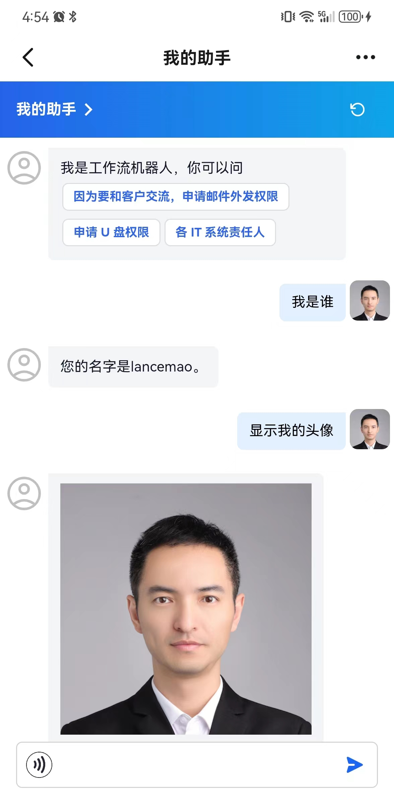
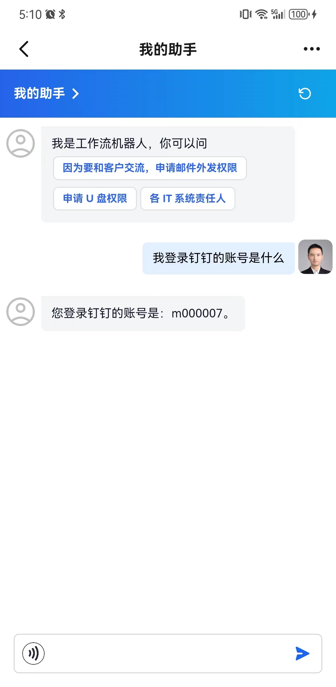
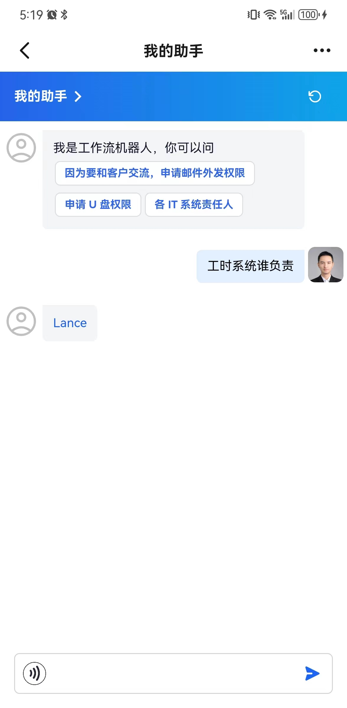
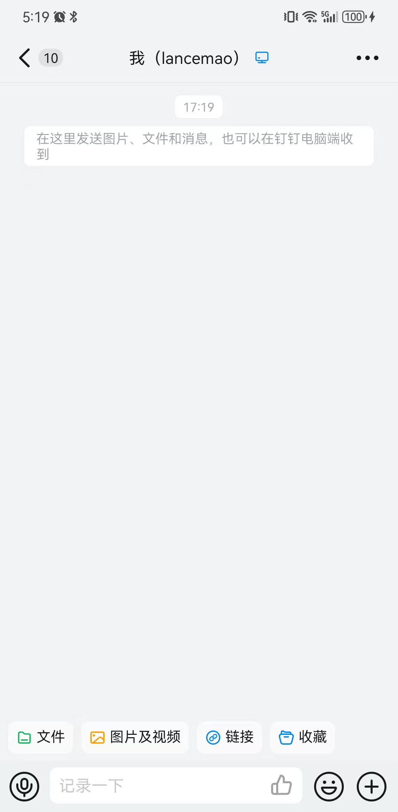
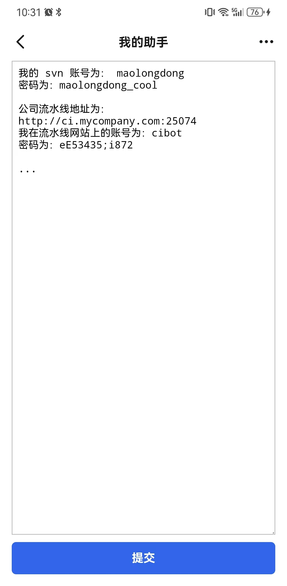
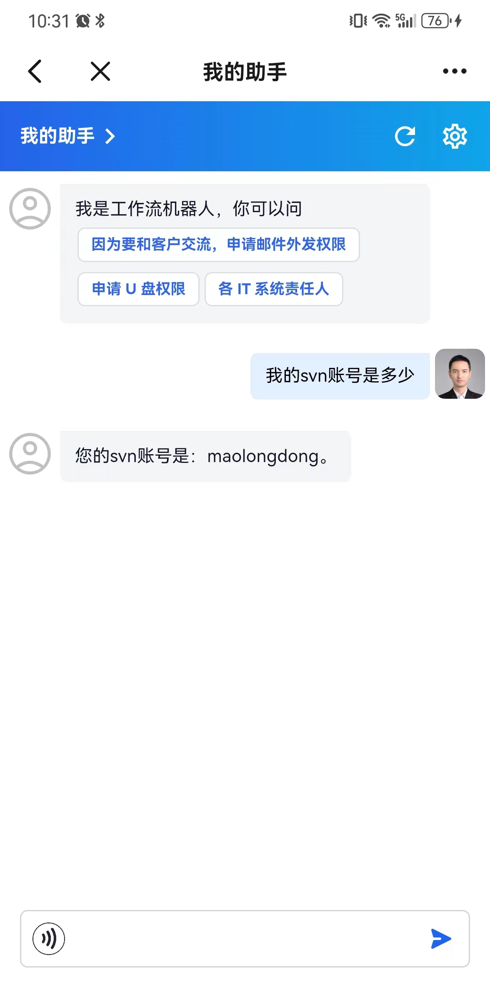
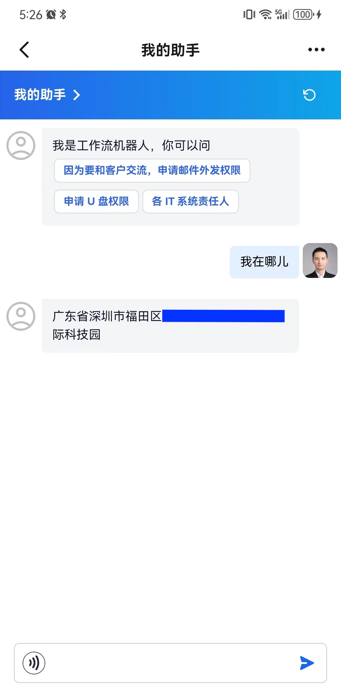

# Enterprise Chatbot

An mobile chatbot framework based on [dify agent](https://github.com/langgenius/dify)

## Features

- Auto login for enterprise OA like Dingtalk
- Can ask LLM to perform user specific actions like submit an application
- Voice recognition using OA app's native API 
- Very simplified UI and codebase with minimal dependencies

## Get Started

* [Deploy dify](https://docs.dify.ai/getting-started/install-self-hosted)

* [Create app in Dingtalk console](./document/create_dd_app.md)

* [Start backend](./api/README.md)

* [Start frontend](./web/README.md)

## Dingtalk Showcase

### Home

### User Context

You can always ask LLM `who you are?` and it will give you its basic information. But you can't ask LLM `who I am?` because it doesn't have the context of the current user. Now, since we are inside dingtalk, we can get user's information via dingtalk's open api so that our Agent knows the context

It would be dumb to tell user who they are, of course user know who they are. However, user might forget (or really don't know) more *advanced* information like the precise name of their department, their role, their employee number etc, not to mention more remote-related information like their manager, their direct subordinates, their colleagues etc, even, their parent's birthday, but that is another story.

### Seamless Navigation

In workplace, we often need to ask for help, e.g. *who knows how to use the printer.* We can store such information in our Agent and the little trick is to return not only the name of the person, but also the link of the person so that when user clicks on the link, it opens a chat directly

 
### In-chat User Options

when user asks the bot to submit an application, chances are user is not providing all the required information. Our bot will help user to fill in the missing information.

### Private Data

Store your office information in a notebook? Find it hard to remember? Now you can store all your office information in our Agent and you can ask for some specific information using natural language.

### Location

Have you ever been in a situation when your friend (or customer) asks where you are? Now we can use OA's API to get user's current location and answer location based questions.

## Limitations

* Use my [dify fork](https://github.com/lancemao/dify) with SSO implemented
* Quite many dify frontend features are not supported yet, and some are modified
* Although some basic feature might work in PC, but many won't

