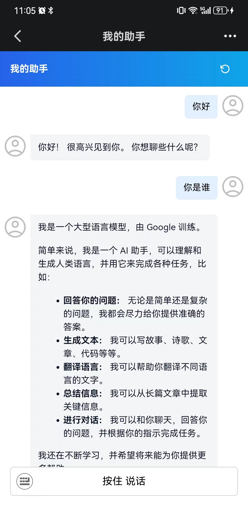
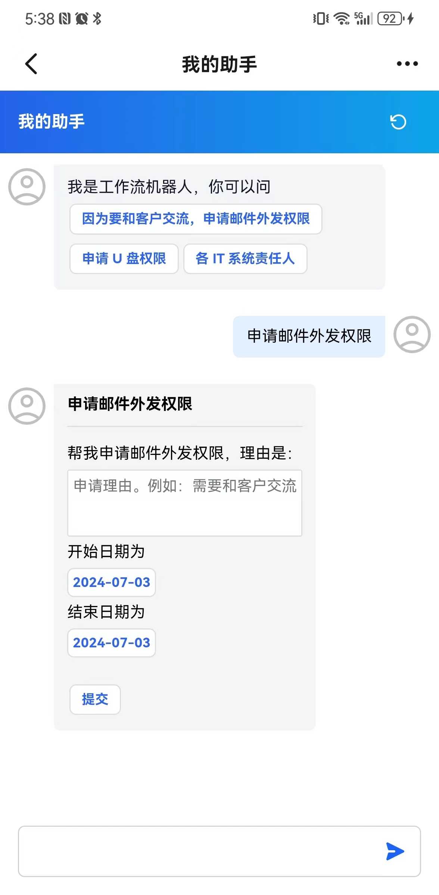
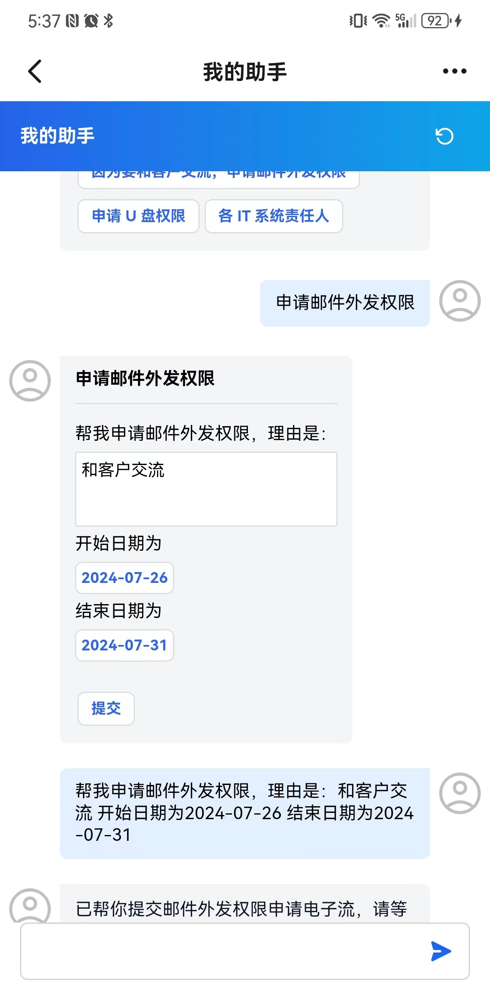

# Enterprise Chatbot

An mobile chatbot framework based on [dify agent](https://github.com/langgenius/dify)

## Features

- Auto login for enterprise OA like Dingtalk
- Can ask LLM to perform user specific actions like submit an application
- Voice recognition using OA app's native API 
- Very simplified UI and codebase with minimal dependencies

## Get Started

* [Deploy dify](https://docs.dify.ai/getting-started/install-self-hosted)

* [Create app in Dingtalk console](./document/create_dd_app.md)

* [Start backend](./api/README.md)

* [Start frontend](./web/README.md)

## Dingtalk showcase

### Home

### in-chat user options

when user asks the bot to submit an application, chances are user is not providing all the required information. Our bot will help user to fill in the missing information.

