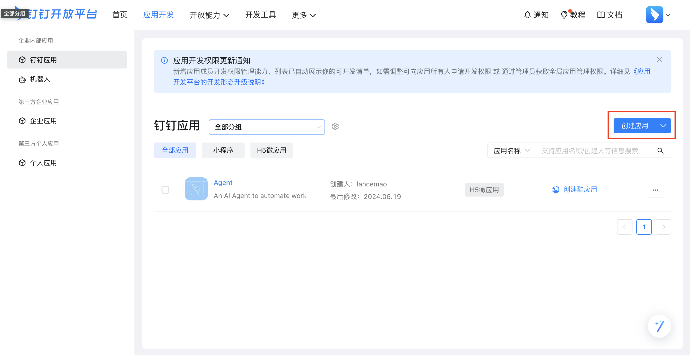
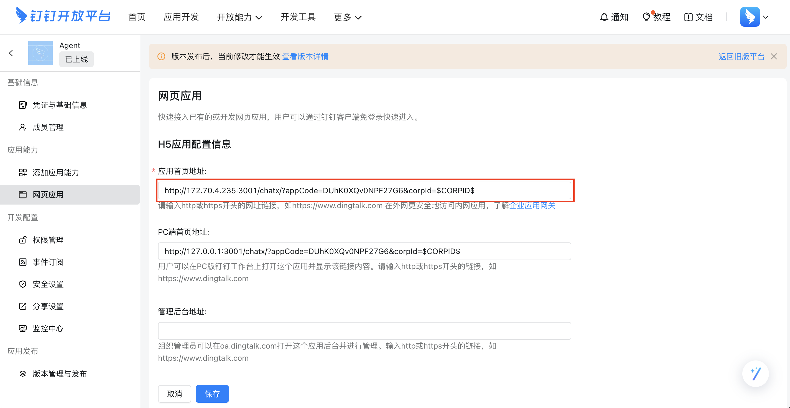
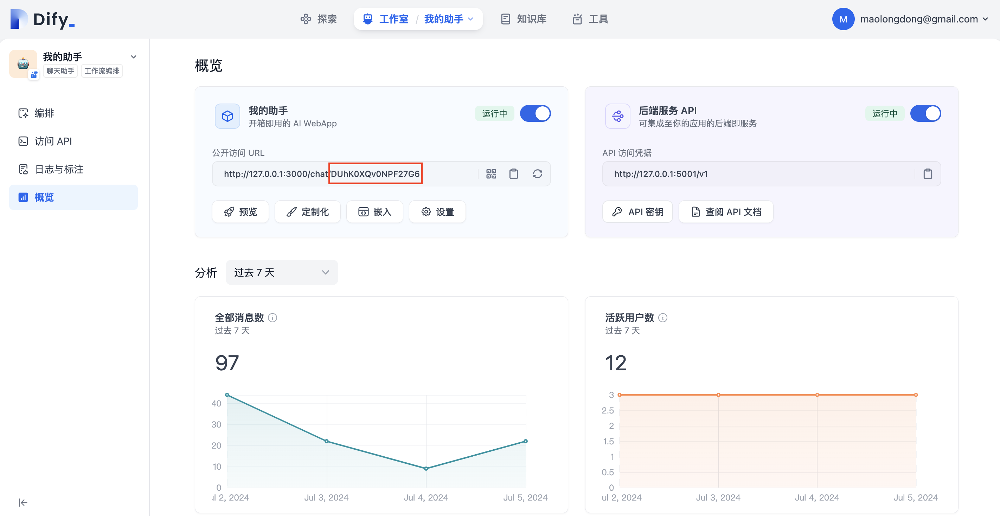

# Create Dingtalk App

First create a Dingtalk account and then create an organization, both are free.

Then in [Dingtalk console](https://open-dev.dingtalk.com/fe/app?hash=%23%2Fcorp%2Fapp#/corp/app), create an app:



in app setting, enter our agent's url, in my case:

```
http://172.70.4.235:3001/chatx/?appCode=DUhK0XQv0NPF27G6&corpId=$CORPID$
```



```
I have entered an IP address of 172.70.4.235 since I will use my cell phone to test and my phone is in the same LAN with my development machine
```

Two important notes:

* in the example above, ```DUhK0XQv0NPF27G6``` is my local deployed dify app's appCode, you can get it in dify console here



* add ```corpId=$CORPID$``` to the url. When our Dingtalk app is started inside Dingtalk, it will replace this with the actual corpId of the Dingtalk organization.

